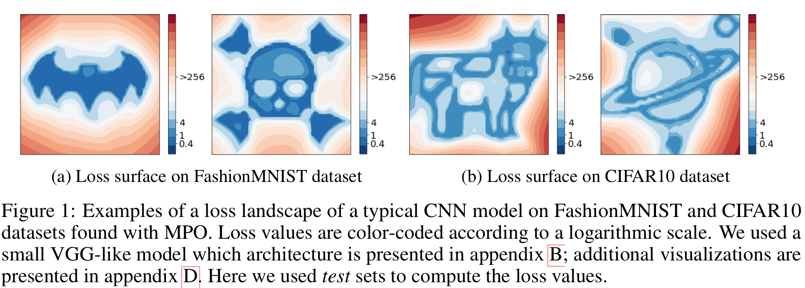

Implementation of [Loss Landscape Sightseeing with Multi-Point Optimization](https://arxiv.org/abs/1910.03867).



To implement the results you will need to clone this repo (note the `--recursive` flag which is needed since we use submodules) first:
```
git clone --recursive https://github.com/universome/loss-patterns
```

And then install [firelab](https://github.com/universome/firelab) and run the following command:
```
firelab start configs/icons-mask-hpo.yml
```

If you have any questions, found a bug or just want to discuss something — do not have the slightest piece of hesitation to drop me an email on iskorokhodov@gmail.com.
